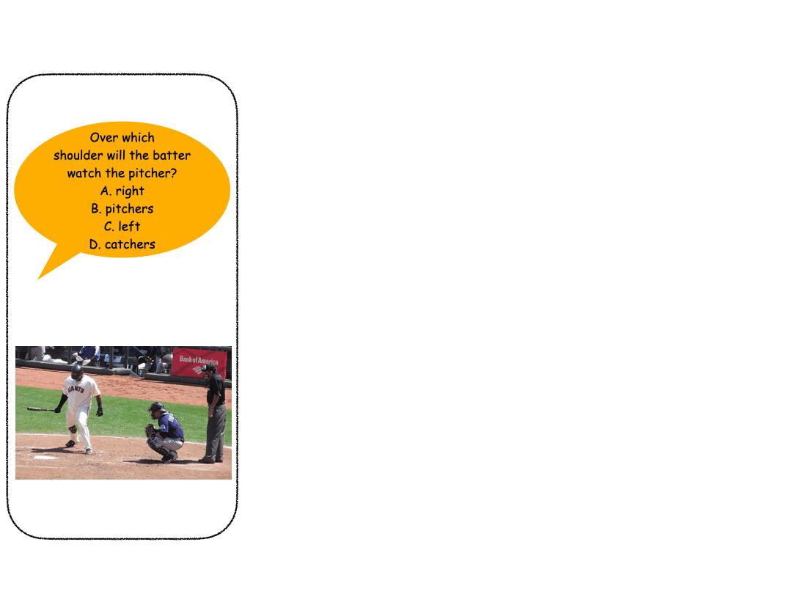

# Test-Time Hinting

**Paper:** [Test-Time Hinting for Black-Box Vision-Language Models](https://arxiv.org/abs/2605.16410)

**Authors:** [Kaihua Hou](https://kaihua-hou.com/), [Abhijith Varma Mudunuri](https://github.com/mabhi02), [Jiaxing Qiu](https://med.virginia.edu/advanced-medical-analytics/our-people/jiaxing-joy-qiu-ms-phd/), [Roxana Daneshjou](https://profiles.stanford.edu/roxana-daneshjou), [Thomas Hartvigsen](https://www.tomhartvigsen.com/), [Ahmed Alaa](https://vcresearch.berkeley.edu/faculty/ahmed-alaa)

Test-time scaling (TTS) methods have proven highly effective for LLMs, yet their application to vision-language models (VLMs) remains relatively underexplored. Existing VLM TTS methods largely require open-weight model access or expensive repeated sampling, and are evaluated primarily on multimodal mathematical and scientific reasoning benchmarks rather than general visual understanding tasks. In this paper, we propose *Test-Time Hinting*, a method that improves VLM performance via a single VLM call and requiring only black-box API access, which makes it broadly applicable to frontier closed-weight models. Our method is motivated by the observation that VLM errors tend to cluster around recurring failure patterns. We therefore train a lightweight hint generator model to predict, for a given test input, which "hint" should be prepended to the prompt, providing targeted contextual or procedural guidance that steers the VLM away from its characteristic failure modes. We show that Test-Time Hinting improves the accuracy of multiple closed-weight VLMs on natural-image VQA benchmarks and that these gains generalize to unseen benchmarks and VLMs without retraining the hint generator.



## Phases

The pipeline runs in three phases:

1. **Base response sampling** (`tth.phase1`) — query one or more target VLMs on the input questions and record per-model answers and reasoning. These answers determine which examples need *repair* hints (base answer was wrong) and which need *reinforcement* hints (base answer was right and should be kept right under the hint).
2. **Agentic hint optimization** (`tth.phase2`) — a Proposer / Checker / Experimenter loop produces a hint per example. The Proposer drafts a short hint, the Checker enforces safety and quality (no answer leakage, contrastive guidance, no overthinking), and the Experimenter is the target VLM, which re-answers under the hint so the loop can terminate when the model answers correctly (repair) or stays correct (reinforcement).
3. **Hint generator SFT + GRPO** — train a lightweight hint generator on the optimized hints. Phase 3a (`tth.phase3a`) runs supervised fine-tuning via [ms-swift](https://github.com/modelscope/ms-swift) on the (image, question) → hint pairs. Phase 3b (`tth.phase3b`) continues with GRPO via [TRL](https://github.com/huggingface/trl) + [PEFT](https://github.com/huggingface/peft), using the actual base-VLM correctness signal as reward.

## Setup

```bash
pip install -r requirements.txt
```

Or:

```bash
pip install -e .
```

Set API keys for the providers you intend to use:

- `OPENAI_API_KEY` — OpenAI models
- `ANTHROPIC_API_KEY` — Anthropic models
- `GEMINI_API_KEY` — Google Gemini models

## Config

Each phase reads its settings from a YAML config under `configs/`:

- `configs/phase1.yaml` — base VLMs to sample from, input CSV, generation parameters
- `configs/phase2.yaml` — Proposer / Checker / Experimenter models and the agentic loop settings (e.g. `max_hint_rounds`)
- `configs/phase3a.yaml` — ms-swift SFT settings (model, dataset, LoRA tuning scope, hyperparameters)
- `configs/phase3b.yaml` — TRL GRPO settings (init adapter, training dataset, reward target VLMs, training hyperparameters)

Fill in the placeholders (paths, model IDs, hyperparameters) in each config before running the corresponding phase.

## Citation

```bibtex
@misc{hou2026tth,
  title         = {Test-Time Hinting for Black-Box Vision-Language Models},
  author        = {Kaihua Hou and Abhijith Varma Mudunuri and Jiaxing Qiu and Roxana Daneshjou and Thomas Hartvigsen and Ahmed Alaa},
  year          = {2026},
  eprint        = {2605.16410},
  archivePrefix = {arXiv},
  primaryClass  = {cs.CV},
  url           = {https://arxiv.org/abs/2605.16410}
}
```

